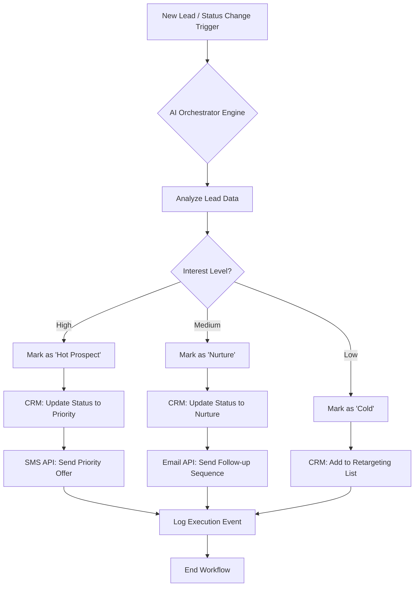
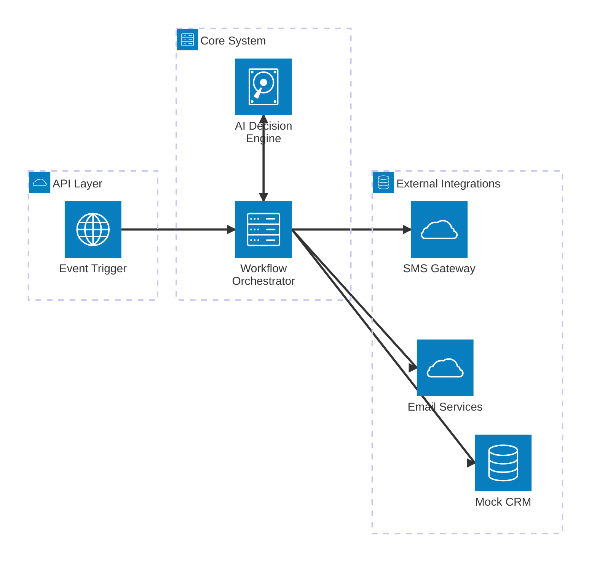
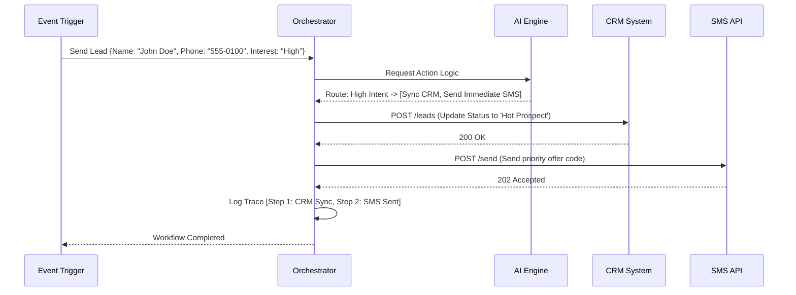

# Intelligent Workflow Automation System
**Project Design & Execution Document**

---

## 1. Goal Description
The objective of this project is to automate end-to-end workflows across CRM, ERP, and messaging platforms with dynamic AI decision-making. The system processes incoming lead data (Name, Phone, Status, Interest Level) and orchestrates conditional actions in real-time.

## 2. Implemented Features
- **Workflow Orchestration Engine**: Built a scalable, modular Engine (`WorkflowOrchestrator`) in Python to completely replace hardcoded logic.
- **Conditional Logic & Dynamic Adaptation**: Rules evaluate the input triggers dynamically to classify users into High, Medium, or Low intent sequences.
- **Integration Across Systems**: Developed isolated mock systems (`CRMIntegration`, `SMSIntegration`, `EmailIntegration`) that get invoked sequentially based on the engine's routes.

---

## 3. Expected Deliverables

### A. Workflow Diagram


### B. Integration Architecture


### C. Sample Execution Flow
**System Sequence Trace**


**Batch Processing Output Log (`simulate_dataset.py`)**
```text
======================================================
INTELLIGENT WORKFLOW AUTOMATION: BATCH EXECUTION TRACE
======================================================

[L_1000] Processing New Trigger -> Name: Aarav Sharma | Status: New | Interest Base: High
   -> Step 1: Received new lead processing request from Batch Excel Dataset.
   -> Step 2: Lead Classification: HIGH Intent (Score: 0.85).
   -> Step 3: Integration: Updated CRM record status to 'HOT Prospect'.
   -> Step 4: Integration: SMS API triggered with message 'priority offer code'.
   -> Step 5: Workflow execution complete.
------------------------------------------------------------
```
